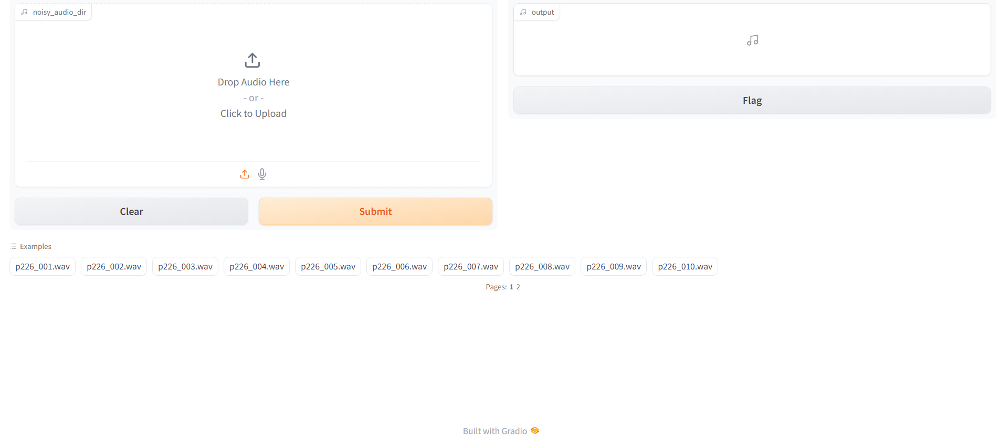

# SESNNet : Speech Enhancement using Spiking Neural Networks

## Table of Contents

  * [1. Introduction](#1-introduction)
  * [2. Dataset](#2-dataset)
  * [3. Installation](#3-installation)
  * [4. Web application using Gradio](#4-web-application-using-gradio)
  * [5. Experiment tracking using Comet ML](#5-experiment-tracking-using-comet-ml)
  * [6. Main Module Details: main.py](#6-main-module-details-mainpy)
  * [7. Documentation](#7-documentation)
  * [8. Project Files Structure](#8-project-files-structure)
  * [9. Cite](#9-cite)


## 1. Introduction

Welcome to the SESNNet repository, which showcases research conducted during my master's program at Université de Sherbrooke. This project focuses on speech enhancement using spiking neural networks (SNNs). Our objective is to develop an SNN model that can rival the performance of conventional artificial neural networks (ANNs) while demonstrating superior energy efficiency.

For an in-depth exploration of our findings, refer to our conference paper available at https://doi.org/10.1109/CCECE58730.2023.10288830.

## 2. Dataset

The audio dataset used in this project is available at https://datashare.ed.ac.uk/handle/10283/2791

## 3. Installation

To set up the essential dependencies, create a Python environment and use `pip` along with the provided requirements file:

```
$ python.exe -m pip install --upgrade pip
$ pip install -r requirements.txt
```

## 4. Web application using Gradio

Explore the capabilities of the proposed speech enhancement model based on spiking neural networks (SNNs) through the [Gradio](https://www.gradio.app/)-powered web interface. Execute the following command to activate the web interface:

```
$ gradio app.py
```



> **_NOTE:_** The audio examples used in this interactive interface are retrieved from the dataset mentioned in Section 2. For details about the dataset, including its origin and composition, refer to [Dataset Section](#2-dataset).


## 5. Experiment tracking using Comet ML

Sign up for an account on [comet.ml](https://www.comet.com/site/).

## 6. Main Module Details: main.py

The `main.py` program serves as a versatile platform for conducting experiments with diverse speech enhancement models, employing either spiking neural networks or conventional artificial neural networks.
conventional neural networks.

### Basic arguments

| Short   | Long                        | Type    | Default | Description                                                                               |
|---------|-----------------------------|---------|---------|-------------------------------------------------------------------------------------------|
| `-m`    | `--model_name`              | str     | UNetSNN | Name of the model                                                                         |
| `-tr`   | `--train_flag`              | boolean | False   | Boolean that indicates weather to train the model                                         |
| `-e`    | `--nb_epochs`               | int     | 30      | Number of training iterations                                                             |
| `-b`    | `--batch_size`              | int     | 32      | Number of data samples per batch                                                          |
| `-lr`   | `--learning_rate`           | float   | 0.0002  | Learning rate of the model during training                                                |
| `-tnp`  | `--train_neuron_parameters` | boolean | False   | Boolean that indicates weather to train neuron parameters                                 |
| `-r`    | `--recurrent_flag`          | boolean | False   | Boolean that indicates weather to add recurrence term to the input current equation       |
| `-dr`   | `--detach_reset`            | boolean | False   | Boolean that indicates weather to detach the computation graph of reset term in backward  |
| `-dist` | `--use_ddp`                 | boolean | False   | Boolean that indicates weather to use Pytorch Distributed Data Parallel (DDP) library     |
| `-pm`   | `--pin_memory`              | boolean | False   | Boolean that indicates pin_memory parameter for the data loader                           |
| `-eval` | `--evaluate_flag`           | boolean | False   | Boolean that indicates weather to evaluate model using the validation set during training |
| `-pmf`  | `--perceptual_metric_flag`  | boolean | False   | Boolean that indicates weather to compute a perceptual metric                             |
| `-sme`  | `--save_mem`                | boolean | False   | Boolean that indicates weather to log hidden activations                                  |
| `-det`  | `--deterministic`           | boolean | False   | Boolean that indicates weather to use deterministic mode for reproducibility              |
| `-pr`   | `--pretrained_flag`         | boolean | False   | Boolean that indicates weather to load a pretrained model                                 |
| `-dbg`  | `--debug_flag`              | boolean | False   | Boolean that indicates weather to use debugging dataset                                   |

### Usage

To train a model, use the following command:
```
$ python main.py --model_name UNetSNN --train_flag --nb_epochs 5 --batch_size 4 --learning_rate 0.0004 --train_neuron_parameters --recurrent_flag --detach_reset --use_ddp --pin_memory --evaluate_flag --perceptual_metric_flag --save_mem --deterministic
```

To test a pretrained model, use the following command:
```
$ python main.py --model_name UNetSNN --pretrained_flag --batch_size 4 --train_neuron_parameters --recurrent_flag --detach_reset --use_ddp --pin_memory --save_mem --deterministic
```

### Help

Run `python main.py -h` or `python main.py --help` for more information.

### Debugging

For debugging purposes,  include the `--debug_flag` argument.

### Experiment tracking

For experiment tracking using Comet ML, include the following arguments: `--workspace <Your Workspace> --api_key <Your API Key> --project_name <Your Project Name>`

## 7. Documentation

For additional details, refer to the documentation file available at [Docs](https://riaa3102.github.io/SESNNet/).

## 8. Project Files Structure

    Speech_enhancement_SNN/
    ├── app.py
    ├── constants.py
    ├── experiments/
    ├── main.py
    ├── requirements.txt
    ├── SpeechEnhancement_data/
    │   ├── audio/
    │   │   ├── __audio_info__/
    │   │   ├── clean_test/
    │   │   ├── clean_train/
    │   │   ├── clean_valid/
    │   │   ├── noisy_test/
    │   │   ├── noisy_train/
    │   │   └── noisy_valid/
    │   └── STFT_4s_nfft=512_wl=512_hl=256/
    │       ├── coefficients/
    │       ├── metadata/
    │       └── reconstruction/
    ├── src/
    │   ├── data/
    │   │   ├── constants.py
    │   │   ├── DatasetManager.py
    │   │   └── TransformManager.py
    │   ├── evaluation/
    │   │   ├── composite.py
    │   │   ├── DNSMOS/
    │   │   └── EvaluationManager.py
    │   ├── model/
    │   │   ├── ArtificialBlock.py
    │   │   ├── ArtificialModel.py
    │   │   ├── constants.py
    │   │   ├── LossManager.py
    │   │   ├── SpeechEnhancer.py
    │   │   ├── SpikingBlock.py
    │   │   ├── SpikingLayer.py
    │   │   ├── SpikingModel.py
    │   │   ├── SurrogateGradient.py
    │   │   ├── TrainValidTestManager.py
    │   │   └── utils.py
    │   ├── stft/
    │   │   ├── constants.py
    │   │   ├── Stft.py
    │   │   └── StftManager.py
    │   └── visualization/
    │       └── VisualizationManager.py
    ├── docsrc/
    │   ├── make.bat
    │   ├── Makefile
    │   └── source/
    ├── docs/
    └── trained_models/

## 9. Cite

```
@INPROCEEDINGS{10288830,
  author={Riahi, Abir and Plourde, Éric},
  booktitle={2023 IEEE Canadian Conference on Electrical and Computer Engineering (CCECE)}, 
  title={Single Channel Speech Enhancement Using U-Net Spiking Neural Networks}, 
  year={2023},
  volume={},
  number={},
  pages={111-116},
  doi={10.1109/CCECE58730.2023.10288830}}
```
