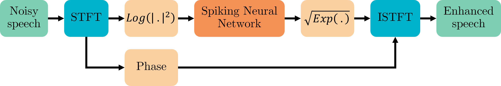
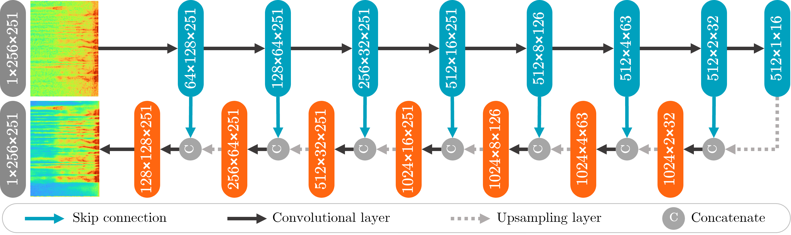

Introduction
==============

Speech Enhancement Using U-Net SNN
------------------------------------

Speech enhancement plays a crucial role in improving the quality of speech signals in various applications, such as telecommunications, voice-controlled systems, and hearing aids. The goal of speech enhancement is to suppress background noise and other distortions while preserving the intelligibility of the speech signal. In recent years, deep learning approaches have demonstrated remarkable performance in speech enhancement tasks.

System overview
+++++++++++++++

The figure below illustrates the workflow of the speech enhancement system.

Description:

    1. Short-Time Fourier Transform (STFT) computation
    2. Log Power Spectrum (LPS) computation
    3. Spiking Neural Network (SNN) model
    4. Enhanced LPS computation
    5. Enhanced STFT magnitude computation
    6. Enhanced speech reconstruction

Network architecture
+++++++++++++++++++++

U-Net SNN combines the benefits of the U-Net architecture and the temporal processing capabilities of spiking neural networks to enhance speech signals in the time-frequency domain.

The figure below illustrates the network architecture of the SNN.

The core principle of the U-Net SNN system lies in its ability to capture complex spectral and temporal patterns in the input speech and noise signals. By leveraging the inherent hierarchical structure of the U-Net architecture, the system can effectively extract and learn informative features at multiple scales. The spiking neural network component further allows for the modeling of temporal dynamics and precise timing information, which can be crucial for accurately separating speech from noise.

Evaluation Metrics
++++++++++++++++++++

The following metrics are commonly used to evaluate the performance of speech enhancement systems:

    - Perceptual Evaluation of Speech Quality (PESQ)
    - Short-Time Objective Intelligibility (STOI)
    - Deep Noise Suppression Mean Opinion Score (DNSMOS)

        - Overall quality of the enhanced speech (OVRL)
        - Quality of the speech signal (SIG)
        - Background noise (BAK)

Results
++++++++

The achieved results are summarized in the table below. The table provides a comparison of various evaluation metrics across different systems.

.. list-table:: Evaluation metrics
   :widths: 7 4 4 4 4 4
   :align: center
   :header-rows: 2

   * -
     -
     -
     -
     - DNSMOS
     -
   * - System
     - PESQ
     - STOI
     - OVRL
     - SIG
     - BAK
   * - Noisy
     - 1.97
     - 0.92
     - 2.69
     - 3.34
     - 3.12
   * - SNN
     - 2.66
     - 0.92
     - 2.81
     - 3.13
     - 3.85
   * - Equivalent ANN
     - 2.89
     - 0.94
     - 2.92
     - 3.23
     - 3.90

- The "Noisy" category represents unprocessed data results.
- The "SNN" system refers to the implemented U-Net spiking neural network model.
- The "Equivalent ANN" system refers to a conventional artificial neural network (ANN) with identical architecture to the implemented SNN, where spiking neurons have been replaced with Leaky ReLU activation functions.